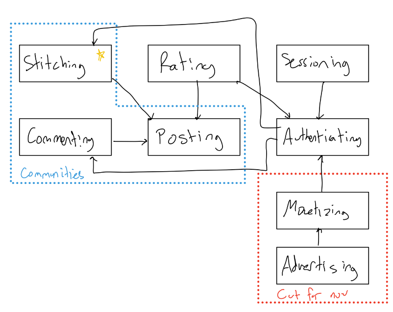

# Pitch
Button is an app for any type of crafter, from woodworker to crocheter. Button will seek to provide crafters with an easy to access resource to source free, high-quality blueprints or patterns for their crafts. Currently in the crafting blueprint market, the main platforms (Ravelry) have mostly paid patterns, so Button would seek to provide value to those that do not wish to spend money on high quality blueprints. Button will have two main types of posts: Blueprint/Pattern posts and Stitches. Blueprints/Patterns are the primary purpose of the app, these posts have media of the craft, pictures, videos, and instructional pdf. Stiches are posts of crafts that users have made using other blueprints on the site, and link back to the blueprint used. These posts will allow users to put their own spin on blueprints and inspire others with new ideas. Button also includes a tagging system to allow for easy search of blueprints. The final semi-unique feature will be the rating system where every blueprint will have a quality rating and a difficulty rating out of 5 stars. The website will also have authentication for users who wish to post, rate, or comment, and sessioning so users can post, rate, and comment, and will not have to log in every time.

# Functional Design
**Concept** Posting[Author] \
**Purpose** Allow public sharing of blueprint through webpage\
**Principle** After uploading a blueprint, title, description, and media, other users can view all these thing on a unique page\
**State**\
posts: set Posts\
	blueprintMedia: posts -> set MediaFiles\
	title, description: posts -> one String\
**Actions** \
makePost(blueprint: Blueprint, medias:set Media, description: String, author: Author, tags: set String, **out** post)\
	post = new Post\
	post.blueprintMedia = Media\
	post.description = description\
post.title = title\
	post.author = author\
	post.tags = tags\
	posts += post\
	return post\
getPost(postId: ID, **out** post Post)\
	return posts[postID]\
delete(author: Author)\
	assert author = this.post.author\
	post -= post\

**Concept** Commenting[Content, Author]\
**Purpose** Allows users to link content to other content\
**Principle** \
**State** postids: set String\
	comments: set Comment\
	content: comments -> one String\
	parent: comments -> one Content\
	authorL comments -> one Author\
**Actions** \
makeComment(parent: Content, content: String, authorL Author, **out** comment Comment)\
	comment = new Comment()\
	comment.content = content\
	comment.parent = parent\
	comment.author = author\
	comments += comment\
	return comment\
getCommentsFromParent(parent: Content, **out** comments set Comment)\
	return comments.find({parent: parent})\
getComment(commentID: ID, **out** comment Comment)\
	return comments[ID]\
delete(author: Author)\
	assert author = comment.author\
	comments -= this.ID\

**Concept** Rating[Content][Author]\
**Purpose** allows users to enumerate their feelings about aspects of a piece of content\
**Principle** Users can select a rating for a post which is average across all rating to show other users general community consensus\
**State** \
	ratings: set Rating\
	authors: map rating -> (author: Author, index: Number, rating: Number)\
	parent: ratings -> one Object\
	values: ratings -> set Integers\
	count: ratings -> set Integers\
**Actions** \
	getRating(parent: Object, **out** rating: Rating)\
		return ratings[parent]\
	averageRatings(**out** averages set Number)\
		return [values[i]/count[i] for range(len(count))]\
	makeRating(parent: Content, rating: Number, ratingIndex: Number, author: Author)\
		if ratings[{parent: parent}] not exist:\
			ratings += new Rating(parent=parent, values=[], count=[])\
		if authors[(ratingId)] exists:\
			values values[ratingIndex] -= authors[(ratingId)].rating\
			count[ratingIndex] -= 1\
		values[ratingIndex] += rating\
		count[ratingIndex] += 1\
	\
\
**Concept** Authenticating\
**Purpose** allow each user to have personalize features\
**Principle** Users can register with a username and password and can identify themselves to the app later with the same username and password\
**State** \
	users: set Account\
	username: users -> one String\
	password: users -> one String\
**Actions** \
	register(username: string, password: string, **out** account: Account):\
	assert username not in users\
	users += [username, password]\
login(username: string, password: string, **out** account: Account):\
	assert password == user[account].password\
	return user[username]\
\
\
**Concept** Sessioning\[User\]\
**Purpose** allows users to continue one authenticated session for a period\
**Principle** once started, until session is ended user is remembered and can be accessed\
**State**\
	active: set Session\
	user: active -> one user\
**Actions**\
	start(user: User, **out** session: Session)\
		session = new Session(user)\
		active += session\
		return session\
	getUser(session: Session, **out** user: User)\
		return active[session].user\
expire(session:Session)\
active -= session\
\
\
**Concept** Stitching\[Content\]\[Author\]\
**Purpose** Users can share their attempts at a craft\
**Principle** Users can create a ‘stitch’ where they share their attempt at blueprint, that links back to the blueprint they followed on the website or the stitch they stitched onto (allows users to modify blueprints and put their own spin on things to inspire others).\
**State**\
	stitches: set Stitch\
	media: stitches -> set mediaFiles\
	parent: stitches -> one Content\
	captions: stitches -> one String\
authors: stitches -> one Author\
**Actions**\
	makeStitch(media :set Media, caption: String, author: Author, parent, **out** Stitch)\
	stitch = new stitch()\
	stitch.media = media\
	stitch.caption = caption\
	stitch.author = author\
	stitch.parent = parent\
	stitches += stitch\
	return stitch\
delete(author: Author)\
	assert stitch.author = author\
	stitch -= stitch\
\
\
\
app\
	including concepts from above\
	\
	**sync** register(username, password: String, **out** session Session):\
		user = Authenticating.register(username, password)\
		return Sessioning.start(user)\
\
	**sync** login(username, password: String, **out** session Session):\
		user = Authenticating.login(username, password)\
		return Sessioning.start(user)\
	\
	**sync** login(username, password: String, **out** session Session):\
		user = Authenticating.login(username, password)\
		return Sessioning.start(user)\
\
	**sync** logout(session):\
		session.end()\
\
	**sync** post(blueprint: Blueprint, media:set Media, description: String, tags: set String)\
		author = session.getUser()\
		Posting.makePost(medias, description, author, tags)\
\
	**sync** deletePost(post: Post)\
		author = session.getUser()\
		post.delete(author)\
\
	**sync** makeComment(parent: Post, content: String, **out** comment Comment)\
		author = session.getUser()\
		return Commenting.makeComment(parent, content, author)\
	\
	**sync** deleteComment(comment: Comment)\
		author = session.getUser()\
		comment.delete(author)\
\
	**sync** 	makeRating( parent: Post, rating: Number, ratingIndex: Number)\
		author = session.getUser()\
		Rating.makeRating(parent, rating, ratingIndex, number)\
	\
    **sync** makeStitch(parent: Post | Stitch, media: set Media, caption: String, **out** Stitch)\
		author = session.getUser()\
		return Stitching.makeStitch(media, caption, author, parent)\
\
    **sync** deleteStitch(stitch: Stitch)\
		author = session.getUser()\
	stitch.delete(author)

# Wireframing
[Link to Figma wireframe](https://www.figma.com/design/7e9ebMUtnIPowvhV4IO1J3/Button-Wireframe?node-id=0-1&t=AGzBuXKFYSsN0G3v-1)

# Design Tradeoffs
**No community-ing**: At first I had a ‘community-ing’ concept, but I realized this concept could be abstracted into a specific group of comments, threads, and posts. Although this may lose some community functionality in the short run, I could create other concepts in the future and work them into the community super-concept

**User only rating and commenting**: Reflecting back on the choosing not to use from the previous assignment: I wanted users to be able to fully engage with the platform without creating an account. I had to choose between letting anyone rate and comment and only letting authenticated users rate and comment. I decided to let only authenticated users do these actions in order to minimize abuse of rating systems (particularly bot spamming).

**No Monetization**: Although monetizing would be one of the most critical aspects of a fully realized Button, I had to choose between including it or excluding it so early in development. I ultimately decided to exclude monetization for now but keep its connections in mind. I decided to cut out monetization in such an early version because although the feature is critical blueprint/pattern making stakeholders monetization could not and should not occur until the platform had a significant user base.
