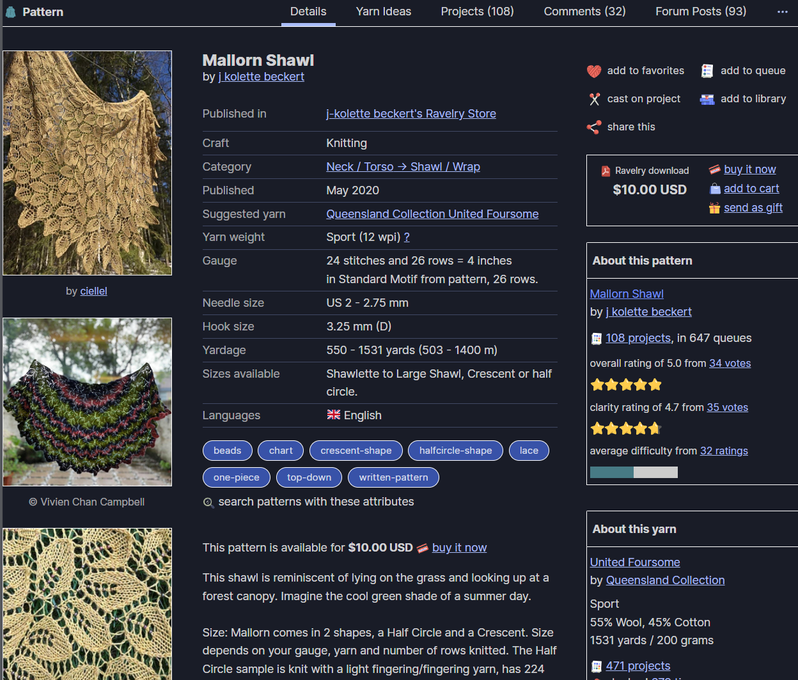
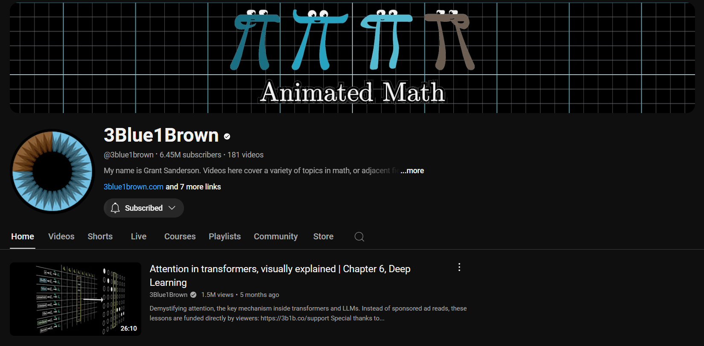
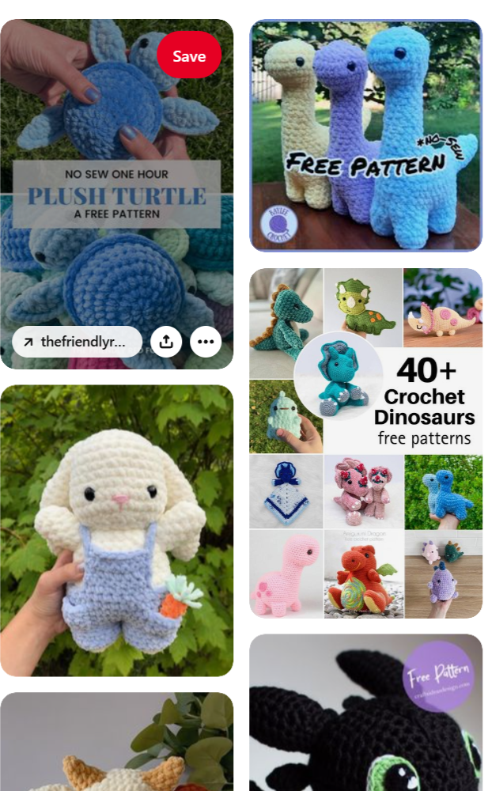
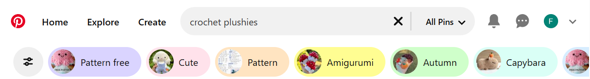
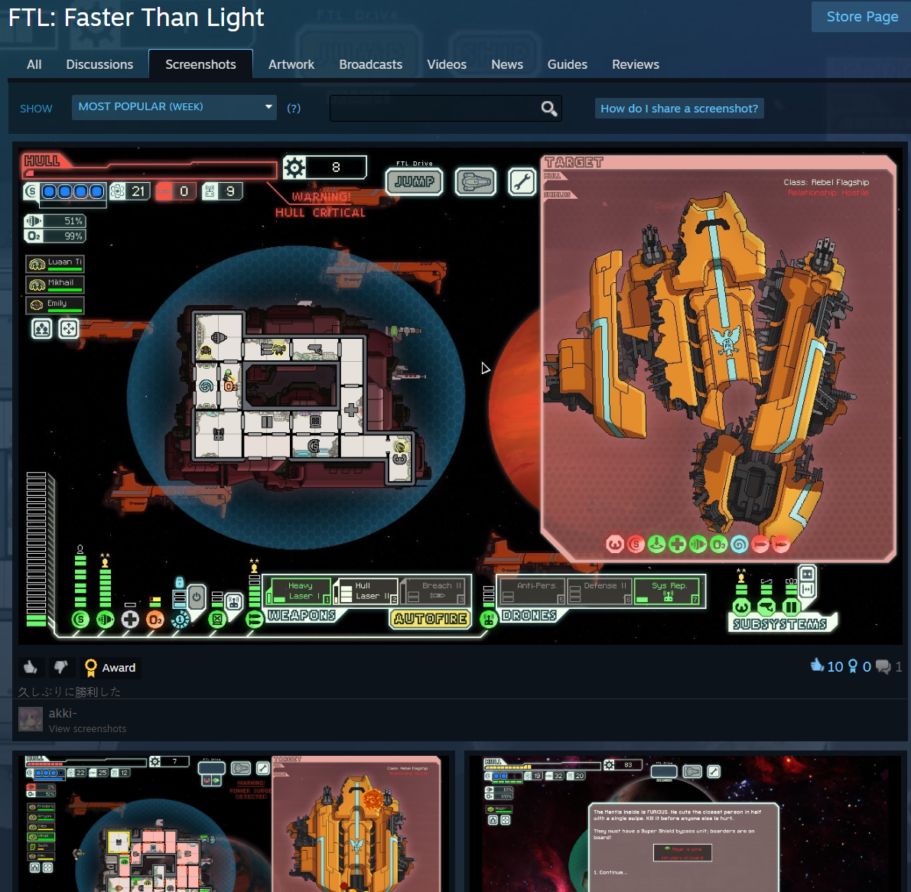
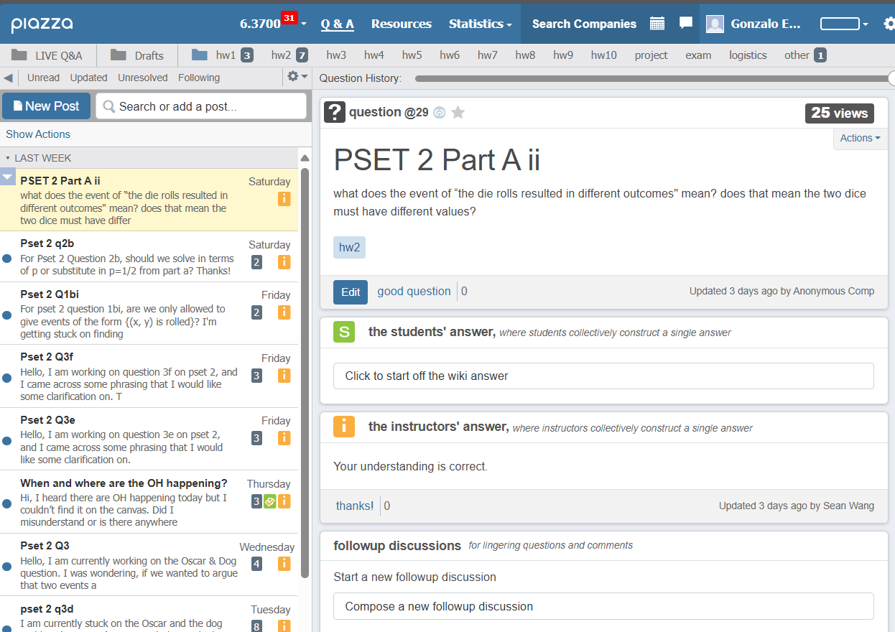
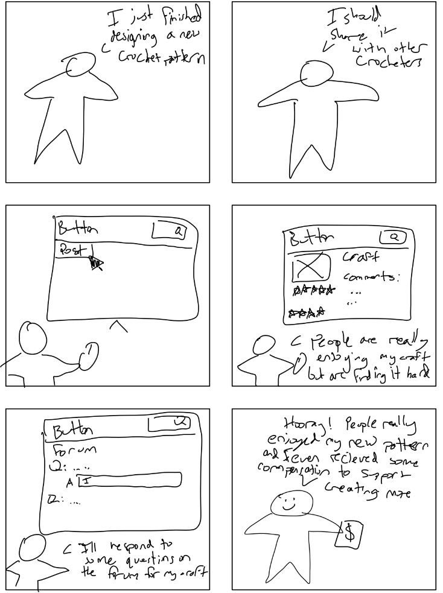

# Divergent Design

## Goal

**Name**: Button

**Audience**: Makers and Crafters of any sort

**Value**: Will provide a resource for free, high-quality blueprints and patterns for any type of craft. Will also provide a place to post projects, and even provide income incentives for creators who provide patterns or blueprints for the community.

## Scrapbook

This is the product page from the fiber art pattern storefront website, Ravelry. It shows many desirable traits for a item page on a crafting website. Such as the rating and difficulty.

The YouTube channel page provides a great example for a creator page, with a custom banner, icon, and description, which could translate to a pattern/blueprint creator page.

The Pinterest multicard display page shows ideas for how to display many projects to users and perhaps implement an explore page.

The Pinterest tags system shows a potential idea for how to display different categories of projects.

The Steam community and specifically screenshots page shows a way for users to quickly share their experience with a game to a community. A system and interface like this would work to share experiences with different crafts.

The Piazza question board provides inspiration for a forum section where users can ask questions about a project and receive answers from other users and the creator.

## Feature Brainstorm

**Creator Pages**: Individuals who create patterns/blueprints for the community can design a custom homepage where they can display their available projects. They should be able to customize many aspects of this page: banner, icon, tags, description etc.

**Difficulty Rating**: Each craft can have a user voted difficulty rating. User's will vote on the difficulty of a craft once they complete it and an average of all user votes will be displayed for the craft.

**Quality Rating**: Each craft can have a user voted quality rating, which will be an average of user votes after they have completed the project.

**User Recommendations**: Data could be collected on what tags and mediums a user typically engages with and could populate their explore page with content of a similar type

**Tagging System**: There will be an in-depth and complete tagging system that will still be simple for users. Users will be able to add custom tags to their works.

**Tag Groups**: There could be different groups of tags, such as a medium tag, a style tag, as well as tags for the difficulty rating (hard might map to 4-5 stars on difficulty rating).

**Tag Descriptions**: Users will be able to define and adjust tags that are not already defined in the system. This will help user properly use tags according to the interest of other users

**Karma System**: Once users comment or vote enough on post they can raise their karma score. This will allow them to adjust tag descriptions and perform other minor moderation tasks.

**Mandatory Blueprints/Recipes**: Every post should have a recipe or blueprint, so that users can recreate any craft they find on the website.

**Blueprint/Recipe Formats**: Creators should be able to post either video or text tutorials for their creations, preferably both so users can have the easiest possible time replicating projects.

**Post Linking**: Each post on the website should either be an original craft post made by a creator, or link to a creator craft post, so that anyone can share their own crafts while still maintaining the above feature.

**Sorting System**: There can be a thorough sorting system for all posts. Users will be able to sort for specific ranges of time, ranges of quality score, and ranges of difficulty score, while still incorporating tags.

**Medium Community Pages**: Each medium (crochet, woodworking, etc.) should have their own community page where top posts of a recent time frame appear. Anyone should easily be able to post their recent projects to this page.

**Explore Page**: There should be an explore page, which can be filtered and sorted, where users can scroll through many thumbnails of different projects to see what may catch their eye.

**Short Form Content System**: Users could swipe through videos of crafts in a way similar to TikTok, users could click through to these crafts pages to pursue the craft. Perhaps this system could also track information on what users like and suggest similar content.

**Downloads**: Users should be able to download video and text instructions for crafts they are interested in so that they can work on them offline.

**Ad Supported Monetization**: Creators can expect humble compensation for posting patterns/blueprints based on how many downloads or views their creations get. This compensation would be funded by on site advertisements, and would encourage high quality content.

**Blueprint/Pattern Sketch Page**: Users could create quick sketches of project ideas and post them to inspire others. This page could include a sketching tool with additional tools for each medium.

**Question Forum**: Each post could have a question forum to clarify challenging steps of the project or discuss adaptations. the creator of the project or other users could respond to questions, but it would be clear to a user who was responding.

**Color Swap Ideas Tool**: A user could key out a certain color on a project and replace it with a different color, this would provide value to most crafters: woodworkers, crocheters, and knitters, as they would be able to see how a project would look with different colors of yarn or wood

## Value Sensitive Design Analysis

- One of the most critical direct stakeholders of Button would be the creators who post the patterns/blueprints. Seeing as the platform would depend on these creators it will be critical to maintain good relationships with creators. This will call for extensions to the compensation system at points in the platforms adoption. This could inspire the design of a creator karma system where once creators reach certain levels through created content which is interacted with, they may gain certain benefits, such as a monetization tier or support access.

- Responding to the consider children prompt, I feel that Button could provide a great resource for early children crafter. Of course the children should receive parental guidance when browsing the web, but perhaps a kids tab could be added to Button, which would contain crafts rated easier and which fall within certain child friendly tabs. Furthermore, this tab would sort on crafts older than 3-6 months such that moderation has plenty of time to catch inappropriate crafts before they would reach this tab.

- Addressing the choosing not to use prompt, with particular respect to User Recommendations and accounts. I feel it would be best to limit the account system, it should be very easy for a user to use the app without an account and access patterns/blueprints. Of course these users wouldn't be able to rate posts, comment, or have a recommended page, but this may be what some users would prefer from the platform.

- In terms of reappropriation, there may be craft adjacent categories that I can't think of. This would suggest the extension to the medium community system, where new medium communities could form if many posts tagged with that medium game traction. This would allow for different communities to form within the app over time, that may not have been forseen at its creation.

- With respect to the value of the platform, The three main values that Button will embody would be: Universal Access, Community, and Democratization. In terms of universal access, keeping all patterns free for all users is the key design principle of the platform. For community, creating communities around specific mediums or styles of projects is another critical design consideration of Button. Finally, the best and most successful creators and crafts will be selected by community vote, reflecting the value of democratization.

## Storyboards

