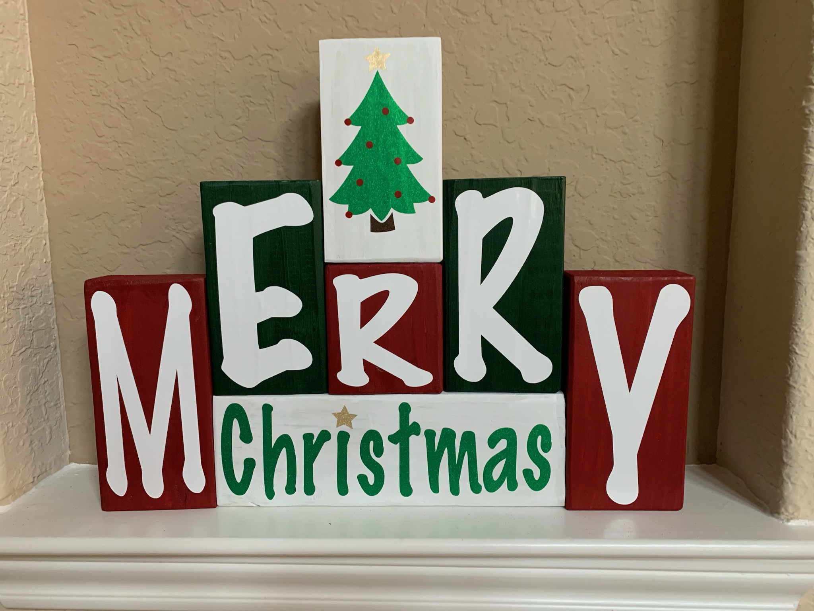

# Needfinding!

<a href="/Needfinding Interview Notes.pdf" download="Interview Notes">Interview Notes</a>

## Interview Planning

**Hunch:** In preliminary conversations, research, and consideration, I believe there may be a lack of a social media purpose built for crafters (Fiber art, Woodworking, etc.).

**Interviewees:** I plan to interview two long time crafters of different age groups: 
- My mother, an older crafter (mostly scrapbooking) who primarily uses facebook.
- My friend who is currently a med student, with a passion for fiber arts, who uses facebook, instagram, and reddit.

**Conversation Starters:**
- What types of crafts do you enjoy -> find out particular crafting interests
- When did you start \*your craft\*? -> evoke stories from interviewee
- Do you have any particular memories involving \*your craft\* that stand out to you? -> evoke stories from interviewee
- How did you get into \*your craft\*? -> evoke stories from interviewee
- How do you get inspiration for \*your craft\*? -> attempt to provoke responses pertaining to seeing crafts on social medias
- How do you like to receive patterns/blueprints for \*your craft\*? -> attempt to find out what experience users want when finding crafts

## Interview Summary
### Cassie and Gabby (My Mom and Sister):
During this interview, Gabby, who is also a crafter, happened to be around and I was fortunately able to interview both Cassie and Gabby at the same time. I opened with the basic question of asking each which types of crafts they did to warm up the conversation, they both had an interest in sewing and Cassie highlighted an interest in "miscellaneous crafting such as my merry christmas wood block". I then asked how each of them get inspiration for their crafts and I was surprised when they both mentioned Pinterest as the main place they source their craft ideas and Gabby included that she also finds many craft ideas on TikTok. When I asked them how like to receive instructions for their crafts Gabby explained "I like my instructions to be in video form because I find written instructions difficult to understand". I pushed Gabby on whether or not she found the the written instructions useful at all and I was surprised how emphatic she was about their usefulness as a supplemental aide to a video tutorial. \
I then pivoted the interview to try and find points of friction in their use of Pinterest to find craft ideas. I asked Gabby to walk me through how she finds a craft on Pinterest. I was surprised when she explained she often searched for specific style and medium of craft and found that items outside of her search parameters would appear. When I asked her why this might be she suggested people inappropriately tag their posts. She further lamented "A majority of the things people post don't have tutorials, or any information how to do it, its just a picture of a craft". At this point in the interview I revealed I was exploring the potential of a social media designed for crafters and wondered if either would be interested in sharing their crafts to a social media platform such as instagram, Cassie said she didn't like posting on social media but Gabby said she would be inclined to share her crafts to her close friends. Finally, when asking if either of them had any closing remarks, Cassie suggested that crafts display their approximate completion time and Gabby suggested that crafts include a difficulty level: "easy, medium, or hard". They both agreed that a sorting and a rating system would improve their craft-finding experience and were both adamant that scaled rating system would be more valuable to them than a like system.

*An Example of A Miscellaneous Craft Made by Cassie*

### Erika:
To warm up the Interviewee I started with asking what type of crafts she was interested in: mostly fiber arts. I also asked Erika when and how she got into fiber arts to further start a conversation and she shared a story about how her grandmother taught her how to knit. When I started to get into the body of the interview I asked her how she gets inspiration and patterns for her Crafts, and she names Youtube as a primary source for her crafting patterns, but mentioned she has started using instagram lately. I was curious as to why she preferred youtube and she explained that she "prefer\[ed\] videos as \[her\] primary resource for fiber arts projects". She also explained that she occasionally find patterns that come included with yarns, certain fiber arts blogs, or from etsy. I noticed that both of these sources offer primarily written instructions and questioned her about this contradiction to her statement that she preferred video instructions. She explained that "\[she\] prefer\[s\] written patterns for easy difficulty crafts, but \[she\] like\[s\] to have video support for harder crafts". This reinforced the importance of both forms of tutorial for a potential craft.
To try to get an idea of the friction points Erika experiences when sourcing a craft, I asked her to walk me through her experience finding instructions for a craft. For instagram, she said that the 60 second video limit made it hard to find comprehensive instructions on instagram, she also mentioned that it is "often unclear what materials the person used, because they are not shown or written in the description," further demonstrating the lack of information provided on instagram. When talking about sourcing crafts from designers blogs or etsy she mentioned that most if not all of the good quality patterns were locked behind a paywall. I was surprised when she explained that the designers who offer free patterns often support themselves through affiliate links. Wrapping up the interview, I asked Erika what features she would be most interested in for a crafting platform, she mentioned that free patterns were most important to her, and I was surprised when she suggested a system that would allow users to discuss patterns with each other in order to clear up challenging parts of the patter.

## Design Opportunities
- Posts must include either a video tutorial or written instructions, preferably both. Alternatively posts could link to other posts whose instructions were followed to create the result. This feature will ensure users will be able to take crafts they like and make them at home. This will avoid the problems with apps like Pinterest where many posts don't have tutorials addressing Gabby's concern for posts without tutorials.
- Posts should have a difficulty rating out of a list of (beginner, easy, medium, hard, expert) as well an approximate completion time. These design facets would allow users to determine at a glance whether they have the skill and time to complete a craft. This feature would prevent users from undertaking projects they would be unable to complete as suggested by Cassie.
- Posts should have applicable tags. These tags should be sourced from a user generated database with user generated descriptions. These tags will help in aid users in searching for crafts in specific mediums and styles. And easily accessible tag descriptions will improve the quality of tags provided on posts creating a platform that makes it easy to find something specific as mentioned by Gabby.
- Posts should be able to be rated on a scale from 1 - 5 and should display average user ratings at a glance. Furthermore search results should be able to be sorted by average rating. This feature will allow users to find the best crafts fitting certain tags as determined by other users.
- Posters will not have the option to paywall their content, but will be welcome to include affiliate links to support themselves. Furthermore, the website can implement an ad supported payments to posters based on numbers of pattern downloads in order to keep the content on the site free and high quality addressing Erika's primary need.
